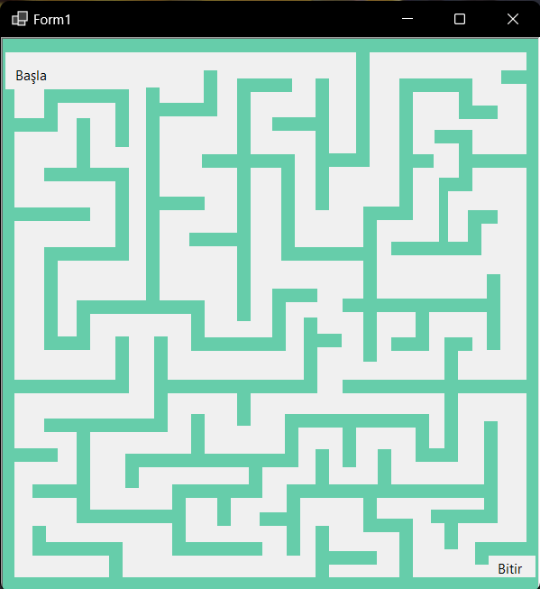

# Windows Forms Labirent Oyunu

## 🧩 Oyun Hakkında

Bu proje, C# dili kullanılarak Windows Forms platformunda geliştirilmiş eğlenceli bir **Labirent Oyunu**dur.  
Oyunda amaç, karakterinizi labirent içerisinden çıkış noktasına güvenli bir şekilde ulaştırmaktır. Duvarlara çarpmadan hedefe ulaşmak için dikkatli hareket etmelisiniz.

---

## 🛠️ Özellikler

- Windows Forms arayüzü ile görsel labirent ortamı  
- Başlangıç ve bitiş noktalarıyla dinamik seviyeler  

---

## 📷 Oyun İçi Görüntü



### 

---

## ⌨️ Kontroller

- **Mouse**: Karakteri hareket ettirmek için kullanılır.

---

## 🚀 Projeyi Çalıştırma

Projeyi kendi bilgisayarınızda çalıştırmak için:

1. Bu repository'yi klonlayın:
   
   ```bash
   git clone https://github.com/k0laa/Windows_Forms_Labirent_Oyunu.git
   ```

2. Visual Studio veya uyumlu bir C# IDE'si ile projeyi açın.
   _veya:_

3. `Windows_Forms_Labirent_Oyunu\bin\Debug\net8.0-windows\Windows_Forms_Labirent_Oyunu.exe` dosyasını çalıştırarak oyunu başlatabilirsiniz.

---

## 📂 Proje Yapısı

```
Windows_Forms_Labirent_Oyunu/
├── resources/
│   └── game.png
├── Windows_Forms_Labirent_Oyunu.sln
├── Windows_Forms_Labirent_Oyunu/
│   ├── bin/
│   │   └── Debug/
│   │       └── net8.0-windows/
│   │           └── Windows_Forms_Labirent_Oyunu.exe
│   ├── Form1.Designer.cs
│   ├── Form1.cs
│   └── Program.cs
└── README.md
```
